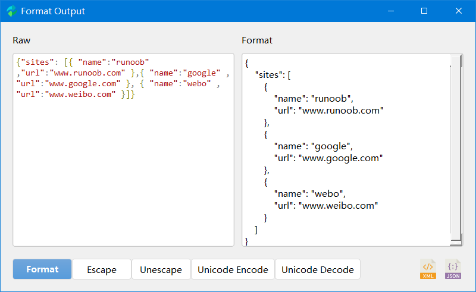

# Reverse Widget

  [-100%25-blue?style=flat-square)](#) 

Reverse Widget is a lightweight GUI Software that implements some typical  block cipher,  coding, hashing, and multi-architecture assemble/disassembly framework. Highlight Features:

- Some Typical Encryption Algorithms: AES, DES, 3DES, RC2
- Useful Coding: URL, Base64
- Common Hash: MD5, SHA1, SHA224, SHA256, SHA384, SHA512
- Multi-architecture Assembler and Disassembler: x86, ARM, mips, Sparc, PowerPC
- Beautify json or xml file

## Detailed Description

### Encrypt/Decrypt

- Support input and output data for String, Hexadecimal and Base64 encoding String
- Support most encryption modes, including ECB, CBC, CFB, OFB, CTR, OPENPGP, OPENPGP, CCM, EAX, SIV, GCM, OCB
- Support three kinds of padding: pkcs7, iso7816 and ansix923

### Encode/Decode

- Support multiple hash algorithms
- Not only includes the hash calculation of ordinary strings, but also the hash of files, which can quickly calculate the hash value of large files

### Assemble/Disassemble

Support multiple architectures (x86, ARM, mips, Sparc, PowerPC), word length (16/32/64bit), big and little endian

The input format supported by assembly: Intel syntax format assembly instructions, and AT&T syntax format assembly instructions (x86)

- `add  x8, x8, x20`
- `add %ecx, %eax` (AT&T x86)

Input format supported by disassembly: hexadecimal or printable hexadecimal

- `08 01 14 8b`   
- `0801148b`
- `\x08\x01\x14\x8b`

Limitations

- X86 only supports little endian (limited by upstream keystone / capstone engine)

- Arm64 only supports little endian (currently aarch64 architecture only has little endian)

- Powerpc32 only supports big endian (currently powerpc32 architecture only has big endian)

### Beautify json/xml
Json and xml are our common http resource files, which are not well displayed in Burpsuite Community Edition. We can easily format them in ReverseWidget.

## Compilation & Docs

### Windows

1. run `setup.bat`
2. run `run.bat`

### Linux & macOS

1. run `setup.sh`
2. run `run.sh`

Of course, you can also see [WIKI](https://github.com/liyansong2018/ReverseWidget/wiki/%E5%BC%80%E5%8F%91%E7%8E%AF%E5%A2%83%E6%90%AD%E5%BB%BA) for how to integrate development environment. 

## Convenient Tool

If you are a lucky dog and Windows user, you can use the out-of-the-box version directly. See [Releases](https://github.com/liyansong2018/ReverseWidget/releases)

This is a software written in my spare time. There may be some bugs which will be improved. Please understand.