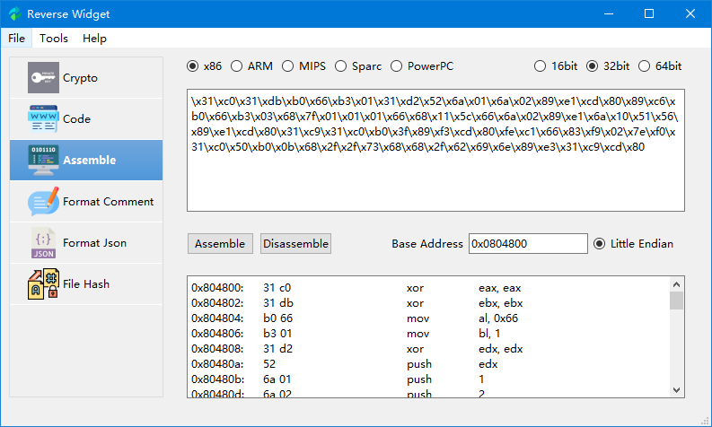
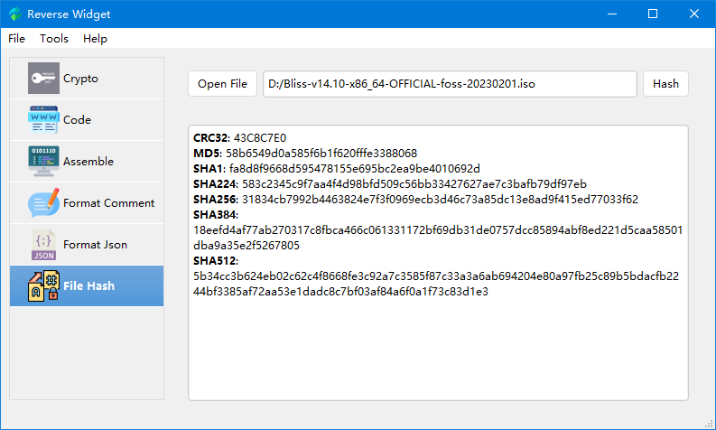
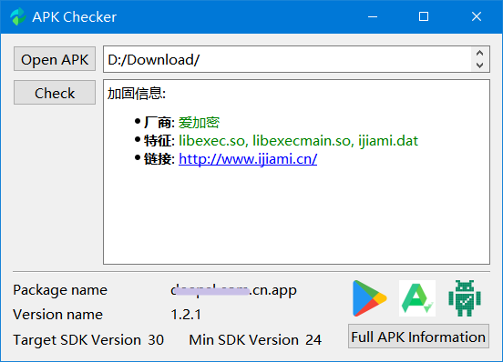

# Reverse Widget

[](#)
[](#) 
[](#) 
[](https://www.python.org/downloads/release/python-380/)
[](#)
[](https://github.com/liyansong2018/ReverseWidget/releases)

👉 [简体中文](https://github.com/liyansong2018/ReverseWidget/blob/master/README_zh.md)

Reverse Widget is a lightweight GUI Software that implements some typical  block cipher, coding, hashing, multi-architecture assemble/disassembly, PE/AndroidAPP shell checker and dll injector. Highlight Features:

- Some Typical Encryption Algorithms: AES, DES, 3DES, RC2
- Useful Coding: URL, HTML, Base64, Unicode, UTF-8
- Multi-architecture Assembler and Disassembler: x86, ARM, mips, Sparc, PowerPC
- Beautify code comment
- Beautify json or xml file
- Common Hash: MD5, SHA1, SHA224, SHA256, SHA384, SHA512, CRC32
- Android App(only for Chinese 梆梆安全/爱加密/360加固保/通付盾/阿里/腾讯应用加固等) checker
- Windows PE checker like `PEID`
- Windows DLL Injector

## Detailed Description

### Encrypt/Decrypt

- Support input and output data for String, Hexadecimal and Base64 encoding String
- Support most encryption modes, including ECB, CBC, CFB, OFB, CTR, OPENPGP, OPENPGP, CCM, EAX, SIV, GCM, OCB
- Support three kinds of padding: pkcs7, iso7816 and ansix923


### Encode/Decode

- Support multiple hash algorithms,such as URL, HTML, Base64, Unicode, and UTF-8
- Not only includes the hash calculation of ordinary strings, but also the hash of files, which can quickly calculate the hash value of large files


### Assemble/Disassemble

Support multiple architectures (x86, ARM, mips, Sparc, PowerPC), word length (16/32/64bit), big and little endian.



The input format supported by assembly: Intel syntax format assembly instructions, and AT&T syntax format assembly instructions (x86)

- `add  x8, x8, x20`
- `add %ecx, %eax` (AT&T x86)

Input format supported by disassembly: hexadecimal or printable hexadecimal

- `08 01 14 8b`   
- `0801148b`
- `\x08\x01\x14\x8b`

Limitations

- X86 only supports little endian (limited by upstream keystone / capstone engine)

- Arm64 only supports little endian (currently aarch64 architecture only has little endian)

- Powerpc32 only supports big endian (currently powerpc32 architecture only has big endian)


### Format Comment

Beautify code comment and splice it into a complete sentence. (e.g. `# // \n`)


### Beautify json/xml

Json and xml are our common http resource files, which are not well displayed in Burpsuite Community Edition. We can easily format them in ReverseWidget.


### File Hash

quickly calculate the hash value of large files.




### APP checker

Check Windows PE file like `PEID`


Check Android APP shell




### DLL injector

DLL injector without back door: Use python module to call win32 without relying on third-party libraries.


## Compilation & Docs

Clone repository
```shell
git clone --recursive https://github.com/liyansong2018/ReverseWidget.git
```

### Windows

1. run `setup.bat` or `pip install -r requirements.txt`
2. run `run.bat`

### Linux & macOS

1. run `setup.sh` or `pip install -r requirements.txt`
2. run `run.sh`

### Ubuntu 20.04
```shell
apt-get install libxcb-xinerama0 
export PATH=$PATH:/home/tom/.local/bin/
```

### Publish binary
```shell
python publish.py debug
python publish.py release
```

If you don't want to install the dependent package, you can also download the [compressed package](https://github.com/liyansong2018/ReverseWidget/releases) that we have already packed.
Of course, you can also see [WIKI](https://github.com/liyansong2018/ReverseWidget/wiki/%E5%BC%80%E5%8F%91%E7%8E%AF%E5%A2%83%E6%90%AD%E5%BB%BA) for how to integrate development environment.

## Convenient Tool

**If you are a lucky dog and Windows user**, you can use the out-of-the-box version directly. See [Releases](https://github.com/liyansong2018/ReverseWidget/releases). This is a software written in my spare time. There may be some bugs which will be improved. Please understand.