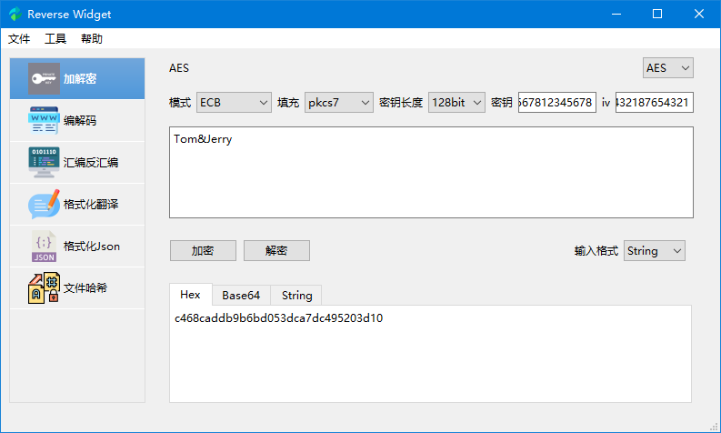
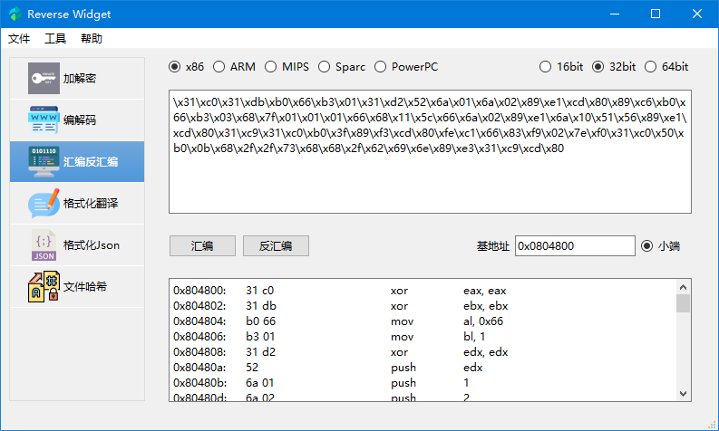
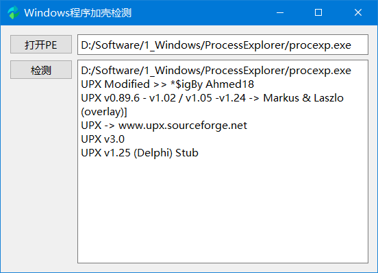
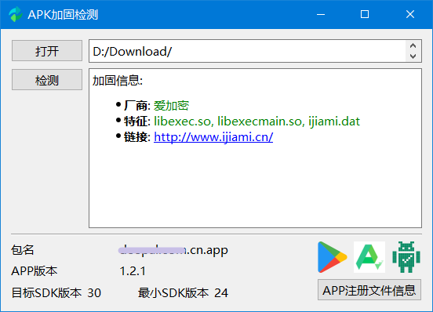
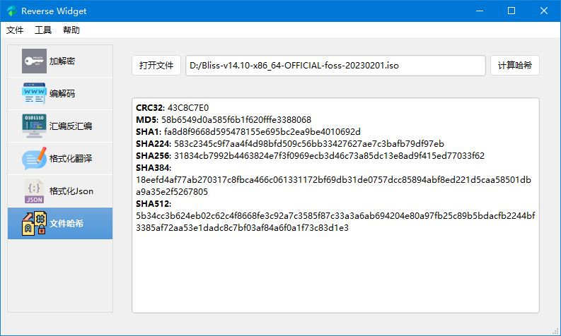
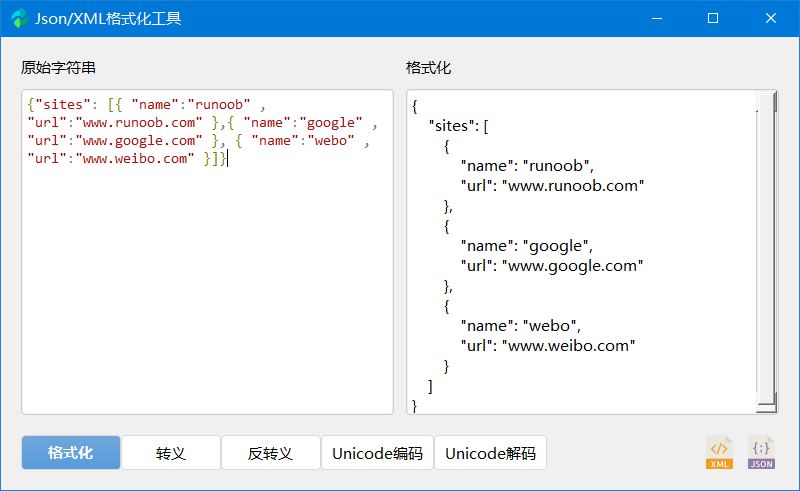

# Reverse Widget

 
 

Reverse Wigdet 是一个完全使用 Python 实现的加解密、编解码、哈希、支持多种架构的汇编和反汇编引擎、Andoid和Windows应用加固检测的**可视化**工具。具有如下特性
- 多个分组加密和解密算法：AES, DES, 3DES, RC2
- 编码和解码：URL, HTML, Base64, Unicode, UTF-8
- 多个哈希算法：MD5, SHA1, SHA224, SHA256, SHA384, SHA512
- 多种架构的汇编和反汇编器：x86, ARM, mips, Sparc, PowerPC
- 格式化json和xml文件
- Android APP加固检测，支持：梆梆安全/爱加密/360加固保/通付盾/阿里/腾讯应用加固等，Windows PE 加壳检测

## 细节性描述

### 加解密

- 支持输入和输出的数据为字符串、十六进制和 Base64 编码
- 支持绝大部分的加密模式，包括 ECB, CBC, CFB, OFB, CTR, OPENPGP, OPENPGP, CCM, EAX, SIV, GCM, OCB
- 支持三种填充模式：pkcs7, iso7816 和 ansix923

### 汇编和反汇编

支持多种架构（x86, ARM, mips, Sparc, PowerPC）、字长（16/32/64bit）、大小端

汇编支持的输入格式：Intel 语法格式的汇编指令，也包括 AT&T 语法格式的汇编指令（ x86）
- `add  x8, x8, x20`
- `add %ecx, %eax` (AT&T x86)

反汇编支持的输入格式：十六进制或者可打印的十六进制

- `08 01 14 8b`   
- `0801148b`
- `\x08\x01\x14\x8b`

局限性

- x86 只支持小端模式（受限于上游的 Keystone/Capstone 引擎）
- ARM64 只有小端模式（当前 AArch64 架构本身只有小端 ）
- PowerPC32 只有大端模式（当前 PowerPC32 架构本身只有小端）

### 应用加固检测器

Windows PE二进制程序检测

Android应用加固检测

### 编解码

- 支持多个哈希算法
- 不仅包含对普通字符串的哈希计算，也包括对文件的哈希，可快速计算大文件的哈希值

### 格式化 json/xml 文件

如果我们使用 Burpsuite 社区版抓包，会发现常见的 xml 以及 json 文件并不能很好的展示，因此 ReverseWidget 新增了格式化资源文件的功能，方便我们查看此类文件。

## 如何使用

### Windows

1. 运行 `setup.bat`，安装基本库
2. 运行程序 `run.bat`

### Linux/macOS

1. 运行 `setup.sh`，安装基本库
2. 运行程序 `run.sh`

如果你不想安装依赖包，你也可以直接下载我们已经打包好的[压缩包](https://github.com/liyansong2018/ReverseWidget/releases)。当然，如果你想修改源码，新增功能，也可以查看我们的环境搭建指导 → [WIKI](https://github.com/liyansong2018/ReverseWidget/wiki/%E5%BC%80%E5%8F%91%E7%8E%AF%E5%A2%83%E6%90%AD%E5%BB%BA)。 

## 开箱即用
如果你是幸运的Windows用户，那么可以直接使用我们已经打包好环境的`exe`可执行程序。请在此处下载 [Releases](https://github.com/liyansong2018/ReverseWidget/releases) 可用的 Windows 可执行程序。这是业余时间编写的一个软件，可能存在一些Bug，正在不断完善中，请谅解。
