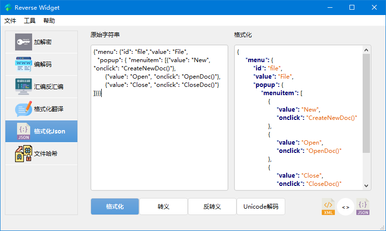

# Reverse Widget

[](#)
[](#) 
[](#) 
[](https://www.python.org/downloads/release/python-380/)
[](#)
[](https://github.com/liyansong2018/ReverseWidget/releases)

Reverse Wigdet 是一组常用的逆向小工具，包括加解密、编解码、哈希、支持多种架构的汇编和反汇编引擎、Andoid 和Windows 应用加固检测以及 DLL 注入。具有如下特性
- 多个分组加密和解密算法：AES, DES, 3DES, RC2
- 编码和解码：URL, HTML, Base64, Unicode, UTF-8
- 多种架构的汇编和反汇编器：x86, ARM, mips, Sparc, PowerPC
- 格式化代码注释
- 格式化 json 和 xml 文件
- 文件哈希：MD5, SHA1, SHA224, SHA256, SHA384, SHA512, CRC32
- Android APP加固检测，支持：梆梆安全/爱加密/360加固保/通付盾/阿里/腾讯应用加固等
- Windows PE加壳检测
- DLL注入


## FAQ

**已有一些在线网站实现了加解密、编解码以及哈希，我们为什么还要重复造轮子？**

> 有时候，涉及到加解密的数据可能比较敏感，在线网站可能会导致信息泄露。Reverse Widget 完全使用 Python 实现，**完全本地化**，可保证敏感数据的机密性。

**汇编和反汇编引擎适用哪些场合？**

> IDA/Ghidra 等工具完美的实现了完美的反汇编，但是对于汇编，可能要借助一些插件，而且它们主要针对整个二进制，而非偏好段指令。Reverse Widget 实现了多架构的汇编和反汇编器，对于二进制指令的修改十分便利。

**App 加固检测有什么特色？**

> Reverse Widget 支持检测 Android 常见的加固方案，当前也并不完善，后续会继续扩充一些功能。但是可以帮助我们在未反编译情况下，快速识别常见的 APP 壳。

**DLL 注入与其他工具相比有什么特点？**

> DLL 注入的工具有很多，但是有一些会存在病毒和后门，我们利用 win32 原生 API，在不依赖其他模块的情况下，编写了 DLL 注入器。如果你想体验各种各样的 DLL 注入方式，如 manual map，此工具可能并不适合你。如果你只是单纯的想往某些进程注入 DLL，那么 Reverse Widget 将会是你不二的选择！


## 细节性描述

### 加解密

- 支持输入和输出的数据为字符串、十六进制和 Base64 编码
- 支持绝大部分的加密模式，包括 ECB, CBC, CFB, OFB, CTR, OPENPGP, OPENPGP, CCM, EAX, SIV, GCM, OCB
- 支持三种填充模式：pkcs7, iso7816 和 ansix923


### 编解码

支持多种编解码


### 汇编和反汇编

支持多种架构（x86, ARM, mips, Sparc, PowerPC）、字长（16/32/64bit）、大小端


汇编支持的输入格式：Intel 语法格式的汇编指令，也包括 AT&T 语法格式的汇编指令（ x86）
- `add  x8, x8, x20`
- `add %ecx, %eax` (AT&T x86)

反汇编支持的输入格式：十六进制或者可打印的十六进制

- `08 01 14 8b`   
- `0801148b`
- `\x08\x01\x14\x8b`

局限性

- x86 只支持小端模式（受限于上游的 Keystone/Capstone 引擎）
- ARM64 只有小端模式（当前 AArch64 架构本身只有小端 ）
- PowerPC32 只有大端模式（当前 PowerPC32 架构本身只有小端）


### 格式化翻译

此模块用于快速格式化代码中的注释，论文中的换行，方便翻译。（ `# // \n`）


### 格式化 json

格式化json或者xml文件，如下图所示，还可以进行json和xml的互转。如果我们使用 Burpsuite 社区版抓包，会发现常见的 xml 以及 json 文件并不能很好的展示，因此 ReverseWidget 新增了格式化资源文件的功能，方便我们查看此类文件。




### 文件哈希

可快速计算大文件的哈希值。


### 应用加固检测器

Windows PE二进制程序检测。


Android应用加固检测


### DLL注入

无毒版本的 DLL 注入，使用 python 模块调用 win32，不依赖三方库。


## 如何使用

克隆项目源码
```shell
git clone --recursive https://github.com/liyansong2018/ReverseWidget.git
```

### Windows

1. 运行 `setup.bat` 或者 `pip install -r requirements.txt`，安装基本库
2. 运行程序 `run.bat`

### Linux/macOS

1. 运行 `setup.sh` 或者 `pip install -r requirements.txt`，安装基本库
2. 运行程序 `run.sh`

### Ubuntu 20.04

```shell
# Ubuntu需要安装依赖和设置环境变量
apt-get install libxcb-xinerama0 
export PATH=$PATH:/home/tom/.local/bin/
```

### 如何将项目打包成可执行程序
```shell
python publish.py debug
python publish.py release
```

如果你不想安装依赖包，你也可以直接下载我们已经编译好的[压缩包](https://github.com/liyansong2018/ReverseWidget/releases)。当然，如果你想修改源码，新增功能，也可以查看我们的环境搭建指导 → [WIKI](https://github.com/liyansong2018/ReverseWidget/wiki/%E5%BC%80%E5%8F%91%E7%8E%AF%E5%A2%83%E6%90%AD%E5%BB%BA)。 


## 开箱即用
如果你是幸运的Windows用户，那么可以直接使用我们已经精简好的`exe`可执行程序。请在此处下载 [Releases](https://github.com/liyansong2018/ReverseWidget/releases) 可用的 Windows 可执行程序。这是业余时间编写的一个软件，可能存在一些Bug，正在不断完善中，请谅解。
